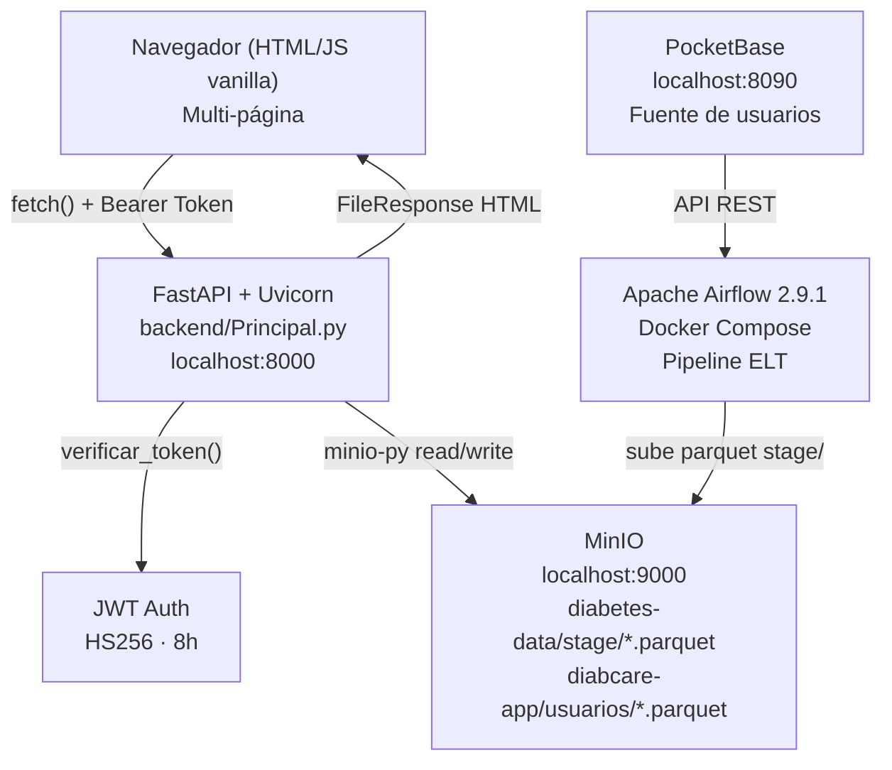

# Documento de Diseño — DiabCare Analytics v2.0

## Visión General

DiabCare Analytics es una plataforma SaaS de análisis clínico de diabetes hospitalaria. El sistema lee archivos `.parquet` almacenados en MinIO, calcula estadísticas con pandas, y expone una interfaz web multi-página con autenticación JWT, gestión de usuarios y visualizaciones clínicas interactivas.

La arquitectura es de tres capas:
- **Presentación**: Frontend multi-página HTML/CSS/JS vanilla servido por FastAPI como archivos estáticos.
- **Aplicación**: API REST con FastAPI + Uvicorn, autenticación JWT, lógica de negocio en servicios Python.
- **Datos**: MinIO (object storage Parquet), PocketBase (usuarios origen), Apache Airflow (orquestación ELT).

---

## Arquitectura



### Flujo de autenticación
1. Usuario envía `POST /api/auth/login` con email y password.
2. Backend verifica credenciales contra `diabcare-app/usuarios/usuarios.parquet`.
3. Si válido, genera JWT con `sub`, `email`, `rol`, `exp` (8h).
4. Frontend almacena token en `localStorage` y redirige al Dashboard.
5. Cada request incluye `Authorization: Bearer {token}` en headers.
6. `Dependencias.py` valida el token y el rol antes de cada endpoint protegido.

### Flujo de datos clínicos
1. Airflow extrae datos de PocketBase y genera archivos `.parquet` en MinIO `stage/`.
2. El generador sintético (`DatasetServicio.py`) crea registros y los sube a `stage/`.
3. `RegistrosClinicosServicio._extraer()` lista todos los `.parquet` en `stage/`, los concatena y retorna un DataFrame unificado.
4. Los endpoints de estadísticas calculan métricas desde ese DataFrame con pandas.

---

## Estructura de Archivos

```
diabcare/
├── backend/
│   ├── Principal.py                      ← Entry point FastAPI, rutas frontend, favicon
│   ├── api/
│   │   ├── autenticacion/
│   │   │   └── AutenticacionRutas.py     ← POST /api/auth/login, logout, cambiar-password, recuperar
│   │   ├── usuarios/
│   │   │   └── UsuariosRutas.py          ← CRUD /api/usuarios/
│   │   ├── registros_clinicos/
│   │   │   └── RegistrosClinicosRutas.py ← GET/POST/PUT/DELETE /api/registros/ + /estadisticas
│   │   ├── dataset/
│   │   │   └── DatasetRutas.py           ← GET /api/dataset/hechos, dimensiones, POST /generar
│   │   ├── prediccion/PrediccionRutas.py
│   │   ├── reportes/ReportesRutas.py
│   │   ├── pipeline_etl/PipelineEtlRutas.py
│   │   ├── notificaciones/NotificacionesRutas.py
│   │   ├── auditoria/AuditoriaRutas.py
│   │   ├── configuracion/ConfiguracionRutas.py
│   │   ├── benchmarking/BenchmarkingRutas.py
│   │   ├── modelo_ml/ModeloMlRutas.py
│   │   └── integraciones/IntegracionesRutas.py
│   ├── servicios/
│   │   ├── autenticacion/
│   │   │   └── AutenticacionServicio.py  ← JWT encode/decode, login, reset password
│   │   ├── usuarios/
│   │   │   └── UsuariosServicio.py       ← CRUD usuarios en MinIO Parquet
│   │   ├── registros_clinicos/
│   │   │   └── RegistrosClinicosServicio.py ← _extraer(), estadisticas(), CRUD registros
│   │   ├── dataset/
│   │   │   └── DatasetServicio.py        ← generar_y_subir() datos sintéticos
│   │   └── configuracion/
│   │       ├── ConfiguracionClienteMinio.py ← get_cliente(), inicializar_buckets()
│   │       └── ConfiguracionAjustes.py      ← constantes (bucket, prefix, puerto, secret)
│   └── utilidades/
│       └── Dependencias.py               ← require_auth, require_admin, require_modulo()
│
├── frontend/
│   ├── estaticos/
│   │   └── estilos.css                   ← Design system compartido (variables CSS, componentes)
│   └── paginas/
│       ├── autenticacion/index.html      ← Login
│       ├── analisis/index.html           ← Dashboard ejecutivo
│       ├── estadisticas/index.html       ← Estadísticas clínicas detalladas
│       ├── registros_clinicos/index.html ← Consultar y filtrar registros
│       ├── dataset/
│       │   ├── index.html                ← Ver tablas del dataset
│       │   └── generador.html            ← Generador de datos sintéticos
│       └── usuarios/index.html           ← Gestión de usuarios
```

---

## Componentes e Interfaces

### Backend — Endpoints principales

| Módulo | Endpoint | Método | Auth | Descripción |
|---|---|---|---|---|
| Auth | `/api/auth/login` | POST | No | Login, retorna JWT |
| Auth | `/api/auth/logout` | POST | Sí | Cierre de sesión |
| Auth | `/api/auth/cambiar-password` | PUT | Sí | Cambio de contraseña |
| Usuarios | `/api/usuarios/` | GET | Admin | Listar usuarios |
| Usuarios | `/api/usuarios/` | POST | Admin | Crear usuario |
| Usuarios | `/api/usuarios/{id}/rol` | PUT | Admin | Cambiar rol |
| Usuarios | `/api/usuarios/{id}` | DELETE | Admin | Desactivar usuario |
| Registros | `/api/registros/` | GET | Auth | Listar con paginación |
| Registros | `/api/registros/estadisticas` | GET | Auth | Estadísticas completas |
| Registros | `/api/registros/buscar` | GET | Auth | Filtrar registros |
| Registros | `/api/registros/` | POST | Auth | Crear registro |
| Registros | `/api/registros/{id}` | PUT/DELETE | Auth | Editar/eliminar |
| Dataset | `/api/dataset/hechos` | GET | Auth | Tabla de hechos paginada |
| Dataset | `/api/dataset/dimension/{nombre}` | GET | Auth | Dimensiones |
| Dataset | `/api/dataset/generar` | POST | Auth | Generar datos sintéticos |
| Dataset | `/api/dataset/estadisticas` | GET | Auth | Stats del dataset |
| Sistema | `/api/health` | GET | No | Health check |

### Servicio de estadísticas — `RegistrosClinicosServicio.estadisticas()`

Calcula desde el DataFrame unificado:
- Conteos: total, con_diabetes, sin_diabetes
- Género: value_counts() del campo gender
- Tabaquismo: agrupado por smoking_history, con/sin diabetes
- Razas: suma de flags por raza, con/sin diabetes
- Edad: pd.cut en rangos [<20, 20-30, 31-40, 41-50, 51-60, 61-70, 70+]
- Promedios: mean() de bmi, hbA1c_level, blood_glucose_level por grupo diabetes
- Comorbilidades: cruce hipertension/heart_disease × diabetes
- Ubicaciones: top 10 por value_counts()
- Tendencia: groupby year con count y sum de diabetes

### Autenticación — `Dependencias.py`

```python
PERMISOS_MODULOS = {
    "usuarios":      ["administrador"],
    "configuracion": ["administrador"],
    "auditoria":     ["administrador"],
    "registros":     ["administrador", "medico"],
    "analisis":      ["administrador", "medico"],
    "prediccion":    ["administrador", "medico"],
    "reportes":      ["administrador", "medico"],
    "dataset":       ["administrador", "analista"],
    "pipeline_etl":  ["administrador", "analista"],
    "modelo_ml":     ["administrador", "analista"],
    "integraciones": ["administrador", "analista"],
    "notificaciones":["administrador", "medico", "analista"],
}
```

### Generador de datos sintéticos — `DatasetServicio.generar_registro()`

Campos generados:
- `year`: parámetro de entrada
- `gender`: Masculino / Femenino / Otro
- `age`: float uniforme [1, 80]
- `location`: ciudades de EE.UU. en español (Alabama, California, Texas...)
- `race_*`: un flag activo por registro
- `hypertension`: probabilístico según BMI
- `heart_disease`: probabilístico según diabetes
- `smoking_history`: nunca / actual / no actual / Sin información
- `bmi`: float uniforme [15, 45]
- `hbA1c_level`: float uniforme [3.5, 9.0]
- `blood_glucose_level`: int uniforme [80, 300]
- `diabetes`: 1 si hbA1c>6.5 o glucosa>200, probabilístico en otros casos

---

## Frontend — Design System

### Variables CSS (`estilos.css`)

```css
:root {
  --bg: #09090f;       /* Fondo principal */
  --bg2: #0d0d15;      /* Sidebar y cards */
  --bg3: #111118;      /* Inputs y hover states */
  --border: rgba(255,255,255,0.07);
  --accent: #2563eb;   /* Azul primario */
  --accent2: #3b82f6;
  --green: #22c55e;
  --red: #ef4444;
  --amber: #f59e0b;
  --mono: 'JetBrains Mono', monospace;
}
```

### Componentes compartidos
- `.sidebar` + `.nav-group` + `.nav-sub-item` — navegación colapsable
- `.stat-card` + `.stat-value` — KPI cards con colores semánticos
- `.tabla-card` + `table` — tablas de datos con hover
- `.btn` + `.btn-primary` + `.btn-ghost` + `.btn-sm` — botones
- `.overlay` + `.modal` — modales con animación
- `.toast` — notificaciones flotantes con auto-dismiss
- `.spinner` — indicador de carga
- `.user-row-wrap` + `.btn-logout` — fila de usuario con botón de cerrar sesión

### Páginas y su fuente de datos

| Página | Ruta | Endpoints consumidos |
|---|---|---|
| Login | `/paginas/autenticacion/index.html` | `POST /api/auth/login` |
| Dashboard | `/paginas/analisis/index.html` | `GET /api/registros/estadisticas`, `GET /api/dataset/estadisticas` |
| Estadísticas | `/paginas/estadisticas/index.html` | `GET /api/registros/estadisticas` |
| Registros | `/paginas/registros_clinicos/index.html` | `GET /api/registros/`, `GET /api/registros/buscar`, `GET /api/registros/estadisticas` |
| Ver tablas | `/paginas/dataset/index.html` | `GET /api/dataset/hechos`, `GET /api/dataset/dimension/*` |
| Generador | `/paginas/dataset/generador.html` | `POST /api/dataset/generar` |
| Usuarios | `/paginas/usuarios/index.html` | `GET/POST/PUT/DELETE /api/usuarios/` |

---

## Modelos de Datos

### Dataset clínico (Parquet en MinIO `diabetes-data/stage/`)

| Columna | Tipo | Descripción |
|---|---|---|
| `gender` | string | Masculino / Femenino / Otro |
| `age` | float | Edad del paciente |
| `location` | string | Ciudad (en español) |
| `year` | int | Año del registro |
| `hypertension` | int (0/1) | Hipertensión preexistente |
| `heart_disease` | int (0/1) | Cardiopatía preexistente |
| `smoking_history` | string | nunca / actual / no actual / Sin información |
| `bmi` | float | Índice de masa corporal |
| `hbA1c_level` | float | Hemoglobina glicosilada |
| `blood_glucose_level` | int | Glucosa en sangre (mg/dL) |
| `diabetes` | int (0/1) | Diagnóstico de diabetes |
| `race_AfricanAmerican` | int (0/1) | Indicador de raza |
| `race_Asian` | int (0/1) | Indicador de raza |
| `race_Caucasian` | int (0/1) | Indicador de raza |
| `race_Hispanic` | int (0/1) | Indicador de raza |
| `race_Other` | int (0/1) | Indicador de raza |

### Usuarios (Parquet en MinIO `diabcare-app/usuarios/usuarios.parquet`)

| Columna | Tipo | Descripción |
|---|---|---|
| `id` | string (UUID) | Identificador único |
| `nombre` | string | Nombre completo |
| `email` | string | Email único |
| `password_hash` | string | SHA-256 del password |
| `rol` | string | administrador / medico / analista |
| `activo` | bool | Estado del usuario |
| `creado_en` | string (ISO) | Fecha de creación |

---

## Manejo de Errores

| Situación | HTTP | Detail |
|---|---|---|
| Credenciales incorrectas | 401 | "Credenciales incorrectas" |
| Token ausente | 401 | "Token requerido" |
| Token expirado | 401 | "Token expirado" |
| Rol no reconocido | 401 | "Rol del token no reconocido" |
| Sin permisos para módulo | 403 | "Su rol '{rol}' no tiene acceso al módulo '{modulo}'" |
| Usuario no encontrado | 404 | "Usuario no encontrado" |
| Email ya registrado | 400 | "Email ya registrado" |
| Registro no encontrado | 404 | "Registro no encontrado" |
| MinIO sin archivos | 200 | DataFrame vacío, retorna lista vacía |
