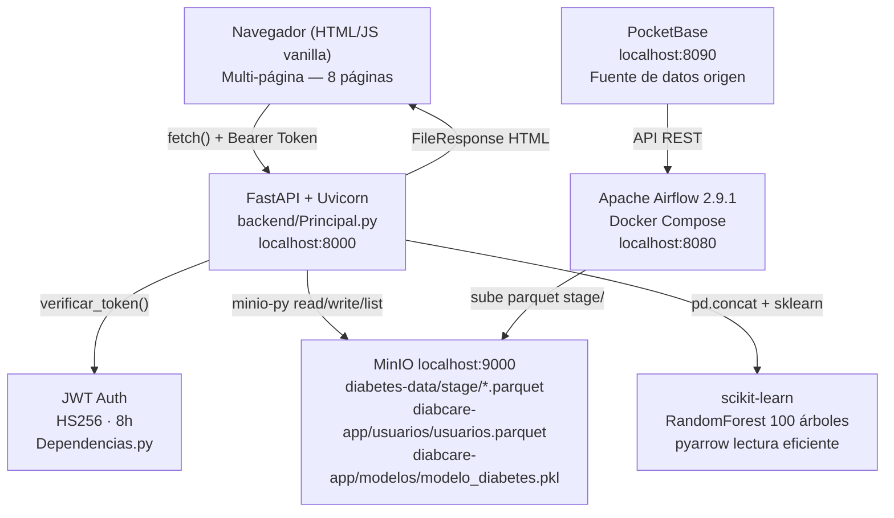

# Documento de Diseño — DiabCare Analytics v2.0

## Visión General

DiabCare Analytics es una plataforma SaaS de análisis clínico de diabetes hospitalaria. El sistema lee archivos `.parquet` almacenados en MinIO, calcula estadísticas con pandas, entrena modelos de predicción con scikit-learn, y expone una interfaz web multi-página con autenticación JWT, gestión de usuarios, visualizaciones clínicas interactivas, predicción ML y monitoreo de pipeline ETL.

La arquitectura es de tres capas:
- **Presentación**: Frontend multi-página HTML/CSS/JS vanilla servido por FastAPI como archivos estáticos con rutas dinámicas.
- **Aplicación**: API REST con FastAPI + Uvicorn, autenticación JWT HS256, lógica de negocio en servicios Python separados por módulo.
- **Datos**: MinIO (object storage Parquet), PocketBase (fuente origen), Apache Airflow 2.9.1 Docker (orquestación ELT).

---

## Arquitectura



### Flujo de autenticación
1. Usuario envía `POST /api/auth/login` con email y password.
2. Backend busca usuario en `diabcare-app/usuarios/usuarios.parquet`, compara SHA-256 del password.
3. Si válido, genera JWT con `sub`, `email`, `rol`, `exp` (8h) usando `python-jose` HS256.
4. Frontend almacena token en `localStorage` y objeto usuario completo, redirige al Dashboard.
5. Cada request incluye `Authorization: Bearer {token}` en headers fetch.
6. `Dependencias.py::verificar_token()` decodifica y valida el token antes de cada endpoint protegido.

### Flujo de datos clínicos (ELT)
1. Airflow extrae datos de PocketBase y genera archivos `.parquet` en MinIO `diabetes-data/stage/`.
2. El generador sintético (`DatasetServicio.generar_y_subir()`) crea registros y los sube a `stage/`.
3. `RegistrosClinicosServicio._extraer()` lista todos los `.parquet` en `stage/` con `minio.list_objects()`, los concatena con `pd.concat()` y retorna un DataFrame unificado.
4. Los endpoints de estadísticas calculan métricas desde ese DataFrame con pandas en memoria.
5. Para conteo rápido sin cargar datos: `pyarrow.parquet.ParquetFile(BytesIO(...)).metadata.num_rows`.

### Flujo de predicción ML
1. `POST /api/prediccion/entrenar` carga el DataFrame completo, entrena RandomForest con split 80/20.
2. Modelo y métricas se serializan con pickle y se suben a MinIO `diabcare-app/modelos/modelo_diabetes.pkl`.
3. `_modelo_cache` almacena el modelo en memoria tras la primera carga.
4. `POST /api/prediccion/` recibe 6 features, llama `modelo.predict()` y `predict_proba()`, retorna diagnóstico + probabilidad + nivel de riesgo.

---

## Estructura de Archivos

```
diabcare/
├── backend/
│   ├── Principal.py                          ← Entry point FastAPI, rutas frontend, favicon 204
│   ├── api/
│   │   ├── autenticacion/AutenticacionRutas.py  ← POST /api/auth/login|logout|cambiar-password|recuperar|resetear
│   │   ├── usuarios/UsuariosRutas.py            ← GET/POST/PUT/DELETE /api/usuarios/
│   │   ├── registros_clinicos/RegistrosClinicosRutas.py ← /api/registros/ + /estadisticas (ANTES de /{id})
│   │   ├── dataset/DatasetRutas.py              ← /api/dataset/hechos|dimension|generar|estadisticas
│   │   ├── prediccion/PrediccionRutas.py        ← /api/prediccion/ POST|entrenar|metricas|estado
│   │   ├── pipeline_etl/PipelineEtlRutas.py     ← GET /api/pipeline/estado
│   │   ├── reportes/ReportesRutas.py            ← (pendiente)
│   │   ├── auditoria/AuditoriaRutas.py          ← (pendiente)
│   │   ├── notificaciones/NotificacionesRutas.py ← (pendiente)
│   │   ├── configuracion/ConfiguracionRutas.py  ← (pendiente)
│   │   ├── benchmarking/BenchmarkingRutas.py    ← (pendiente)
│   │   ├── modelo_ml/ModeloMlRutas.py           ← (pendiente)
│   │   └── integraciones/IntegracionesRutas.py  ← (pendiente)
│   ├── servicios/
│   │   ├── autenticacion/AutenticacionServicio.py  ← JWT encode/decode, login, reset password
│   │   ├── usuarios/UsuariosServicio.py             ← CRUD usuarios en MinIO Parquet
│   │   ├── registros_clinicos/RegistrosClinicosServicio.py ← _extraer(), estadisticas(), CRUD
│   │   ├── dataset/DatasetServicio.py               ← generar_y_subir(), generar_registro()
│   │   ├── prediccion/PrediccionServicio.py         ← entrenar(), predecir(), obtener_metricas()
│   │   └── configuracion/
│   │       ├── ConfiguracionClienteMinio.py    ← get_cliente(), inicializar_buckets(), inicializar_admin()
│   │       └── ConfiguracionAjustes.py         ← MINIO_BUCKET, MINIO_STAGE_PATH, SECRET_KEY, etc.
│   └── utilidades/
│       └── Dependencias.py                     ← require_auth, require_admin, require_modulo(), PERMISOS_MODULOS
│
├── frontend/
│   ├── estaticos/
│   │   └── estilos.css                         ← Design system compartido
│   └── paginas/
│       ├── autenticacion/index.html             ← Login
│       ├── analisis/index.html                  ← Dashboard ejecutivo
│       ├── estadisticas/index.html              ← Estadísticas clínicas 10+ gráficas
│       ├── registros_clinicos/index.html        ← Consultar y filtrar registros
│       ├── dataset/
│       │   ├── index.html                       ← Ver tablas del dataset (5 tabs)
│       │   └── generador.html                   ← Generador de datos sintéticos
│       ├── usuarios/index.html                  ← Gestión de usuarios (solo admin)
│       ├── prediccion/index.html                ← Predicción ML + métricas
│       └── pipeline_etl/index.html              ← Estado y ejecución del pipeline
│
├── dags/                                        ← DAGs de Apache Airflow (vacío — pipeline simulado)
├── docker-compose.yml                           ← MinIO, PocketBase, Airflow 2.9.1
└── requirements.txt
```

---

## Componentes e Interfaces

### Backend — Endpoints completos

| Módulo | Endpoint | Método | Auth | Descripción |
|---|---|---|---|---|
| Auth | `/api/auth/login` | POST | No | Login JWT |
| Auth | `/api/auth/logout` | POST | Sí | Cierre de sesión |
| Auth | `/api/auth/cambiar-password` | PUT | Sí | Cambio de contraseña |
| Auth | `/api/auth/recuperar` | POST | No | Enviar código reset |
| Auth | `/api/auth/resetear` | POST | No | Reset con código |
| Usuarios | `/api/usuarios/` | GET | Admin | Listar usuarios |
| Usuarios | `/api/usuarios/` | POST | Admin | Crear usuario |
| Usuarios | `/api/usuarios/{id}/rol` | PUT | Admin | Cambiar rol |
| Usuarios | `/api/usuarios/{id}` | DELETE | Admin | Desactivar usuario |
| Registros | `/api/registros/estadisticas` | GET | Auth | Estadísticas completas (ANTES de /{id}) |
| Registros | `/api/registros/` | GET | Auth | Listar con paginación |
| Registros | `/api/registros/buscar` | GET | Auth | Filtrar registros |
| Registros | `/api/registros/` | POST | Auth | Crear registro |
| Registros | `/api/registros/{id}` | PUT/DELETE | Auth | Editar/eliminar |
| Dataset | `/api/dataset/hechos` | GET | Auth | Tabla hechos paginada + total pyarrow |
| Dataset | `/api/dataset/dimension/{nombre}` | GET | Auth | Dimensiones |
| Dataset | `/api/dataset/generar` | POST | Auth | Generar datos sintéticos |
| Dataset | `/api/dataset/estadisticas` | GET | Auth | Stats rápidas con pyarrow |
| Predicción | `/api/prediccion/entrenar` | POST | Auth | Entrenar modelo RandomForest |
| Predicción | `/api/prediccion/` | POST | Auth | Predecir diabetes individual |
| Predicción | `/api/prediccion/metricas` | GET | Auth | Accuracy, precision, recall, F1 |
| Predicción | `/api/prediccion/estado` | GET | Auth | Verificar si modelo disponible |
| Pipeline | `/api/pipeline/estado` | GET | Auth | Listar archivos Parquet en MinIO stage/ |

### Servicio de predicción — `PrediccionServicio.py`

```python
FEATURES = ["age", "bmi", "hbA1c_level", "blood_glucose_level", "hypertension", "heart_disease"]
_modelo_cache = {"modelo": None, "metricas": None}

# entrenar(): carga DataFrame completo → RandomForest(n_estimators=100) → pickle → MinIO
# predecir(datos): carga modelo desde cache → predict() + predict_proba() → riesgo según probabilidad
# obtener_metricas(): retorna metricas desde cache o carga desde MinIO
# modelo_disponible(): True si modelo existe en MinIO
```

### Servicio de estadísticas — `RegistrosClinicosServicio._extraer()`

```python
# Lista todos los .parquet en stage/ → pd.concat() → DataFrame unificado en memoria
# Estadísticas calculadas:
# - genero: value_counts()
# - tabaquismo: groupby smoking_history × diabetes
# - razas: sum() de flags race_* por grupo diabetes
# - edad: pd.cut([<20, 20-30, 31-40, 41-50, 51-60, 61-70, 70+])
# - promedios: mean() de bmi/hbA1c_level/blood_glucose_level por grupo diabetes
# - comorbilidades: cruce hypertension/heart_disease × diabetes
# - ubicaciones: top 10 value_counts() de location
# - tendencia: groupby year → count + sum diabetes
```

### Conteo eficiente con pyarrow — `DatasetRutas.py`

```python
import pyarrow.parquet as pq
# Lee solo el footer del parquet sin deserializar datos:
pf = pq.ParquetFile(io.BytesIO(obj.read()))
total += pf.metadata.num_rows
# Resultado: conteo de 600k+ registros en < 2 segundos
```

### Autenticación — `Dependencias.py`

```python
PERMISOS_MODULOS = {
    "usuarios":      ["administrador"],
    "configuracion": ["administrador"],
    "auditoria":     ["administrador"],
    "registros":     ["administrador", "medico"],
    "analisis":      ["administrador", "medico"],
    "prediccion":    ["administrador", "medico"],
    "reportes":      ["administrador", "medico"],
    "dataset":       ["administrador", "analista"],
    "pipeline_etl":  ["administrador", "analista"],
    "modelo_ml":     ["administrador", "analista"],
    "integraciones": ["administrador", "analista"],
    "notificaciones":["administrador", "medico", "analista"],
}
```

### Control de roles en frontend — `aplicarRoles()`

Función presente en todas las páginas del frontend:

```javascript
function aplicarRoles() {
  const u = JSON.parse(localStorage.getItem('usuario') || '{}');
  const rol = u.rol || '';
  const OCULTAR = {
    'medico':   ['Dataset','Usuarios','Pipeline','Modelo','Reportes','Auditor','Notificac','Configur','Benchmark','Integrac'],
    'analista': ['Registros','Usuarios','Modelo','Reportes','Auditor','Notificac','Configur','Benchmark','Integrac'],
  };
  const ocultar = OCULTAR[rol] || [];
  document.querySelectorAll('.nav-group').forEach(g => {
    const label = g.querySelector('.nav-group-label');
    if (!label) return;
    const txt = label.textContent.trim();
    if (ocultar.some(o => txt.includes(o))) g.style.display = 'none';
  });
}
// Llamar con setTimeout(aplicarRoles, 50) al cargar
// Y dentro de funciones que rerenderizen el DOM (ej. dentro de predecir())
```

---

## Frontend — Design System

### Variables CSS (`estilos.css`)

```css
:root {
  --bg: #09090f;
  --bg2: #0d0d15;
  --bg3: #111118;
  --border: rgba(255,255,255,0.07);
  --accent: #2563eb;
  --accent2: #3b82f6;
  --green: #22c55e;
  --red: #ef4444;
  --amber: #f59e0b;
  --mono: 'JetBrains Mono', monospace;
}
```

### Componentes compartidos
- `.sidebar` + `.nav-group` + `.nav-sub-item` — navegación colapsable con `toggle()`
- `.stat-card` + `.stat-value` — KPI cards con colores semánticos
- `.tabla-card` + `table` — tablas de datos con hover
- `.btn` + `.btn-primary` + `.btn-ghost` + `.btn-sm` — botones
- `.overlay` + `.modal` — modales con animación
- `.toast` — notificaciones flotantes con auto-dismiss 3 segundos
- `.spinner` — indicador de carga
- `.user-row-wrap` + `.btn-logout` — fila de usuario con botón cerrar sesión (icono ⏻)

### Páginas y su fuente de datos

| Página | Ruta | Endpoints consumidos |
|---|---|---|
| Login | `/paginas/autenticacion/index.html` | `POST /api/auth/login` |
| Dashboard | `/paginas/analisis/index.html` | `GET /api/registros/estadisticas`, `GET /api/dataset/estadisticas` |
| Estadísticas | `/paginas/estadisticas/index.html` | `GET /api/registros/estadisticas` |
| Registros | `/paginas/registros_clinicos/index.html` | `GET /api/registros/`, `GET /api/registros/buscar`, `GET /api/registros/estadisticas` |
| Ver tablas | `/paginas/dataset/index.html` | `GET /api/dataset/hechos`, `GET /api/dataset/dimension/*` |
| Generador | `/paginas/dataset/generador.html` | `POST /api/dataset/generar` |
| Usuarios | `/paginas/usuarios/index.html` | `GET/POST/PUT/DELETE /api/usuarios/` |
| Predicción ML | `/paginas/prediccion/index.html` | `POST /api/prediccion/entrenar`, `POST /api/prediccion/`, `GET /api/prediccion/metricas`, `GET /api/prediccion/estado` |
| Pipeline ETL | `/paginas/pipeline_etl/index.html` | `GET /api/pipeline/estado`, `GET /api/registros/estadisticas` |

---

## Modelos de Datos

### Dataset clínico (Parquet en MinIO `diabetes-data/stage/`)

| Columna | Tipo | Descripción |
|---|---|---|
| `gender` | string | Masculino / Femenino / Otro |
| `age` | float | Edad del paciente [1-80] |
| `location` | string | Ciudad en español (Alabama, California...) |
| `year` | int | Año del registro |
| `hypertension` | int (0/1) | Hipertensión preexistente |
| `heart_disease` | int (0/1) | Cardiopatía preexistente |
| `smoking_history` | string | nunca / actual / no actual / Sin información |
| `bmi` | float | Índice de masa corporal [15-45] |
| `hbA1c_level` | float | Hemoglobina glicosilada [3.5-9.0] |
| `blood_glucose_level` | int | Glucosa en sangre mg/dL [80-300] |
| `diabetes` | int (0/1) | Diagnóstico de diabetes |
| `race_AfricanAmerican` | int (0/1) | Indicador de raza |
| `race_Asian` | int (0/1) | Indicador de raza |
| `race_Caucasian` | int (0/1) | Indicador de raza |
| `race_Hispanic` | int (0/1) | Indicador de raza |
| `race_Other` | int (0/1) | Indicador de raza |

### Usuarios (Parquet en MinIO `diabcare-app/usuarios/usuarios.parquet`)

| Columna | Tipo | Descripción |
|---|---|---|
| `id` | string (UUID) | Identificador único |
| `nombre` | string | Nombre completo |
| `email` | string | Email único |
| `password_hash` | string | SHA-256 del password |
| `rol` | string | administrador / medico / analista |
| `activo` | bool | Estado del usuario (False = desactivado) |
| `creado_en` | string (ISO) | Fecha de creación |

### Modelo ML (pickle en MinIO `diabcare-app/modelos/modelo_diabetes.pkl`)

```python
{
    "modelo": RandomForestClassifier,  # 100 árboles, random_state=42, n_jobs=-1
    "metricas": {
        "accuracy": float,
        "precision": float,
        "recall": float,
        "f1": float,
        "registros_entrenamiento": int,
        "registros_prueba": int
    }
}
```

---

## Manejo de Errores

| Situación | HTTP | Detail |
|---|---|---|
| Credenciales incorrectas | 401 | "Credenciales incorrectas" |
| Token ausente | 401 | "Token requerido" |
| Token expirado | 401 | "Token expirado" |
| Rol no reconocido | 401 | "Rol del token no reconocido" |
| Sin permisos para módulo | 403 | "Su rol '{rol}' no tiene acceso al módulo '{modulo}'" |
| Usuario no encontrado | 404 | "Usuario no encontrado" |
| Email ya registrado | 400 | "Email ya registrado" |
| Registro no encontrado | 404 | "Registro no encontrado" |
| Modelo no entrenado | 200 | `{"error": "Modelo no entrenado. Llama primero a POST /api/prediccion/entrenar"}` |
| MinIO sin archivos | 200 | DataFrame vacío, retorna lista vacía o total 0 |
