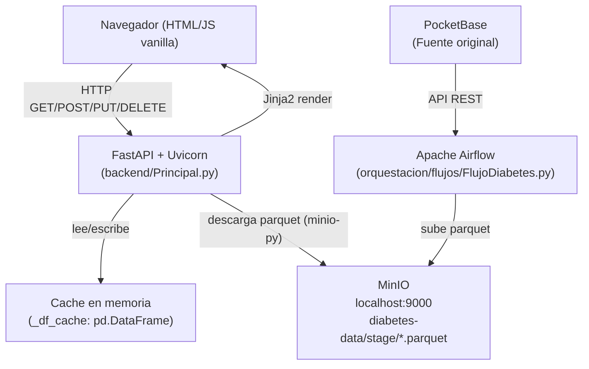

# Documento de Diseño — DiabCare Analytics

## Visión General

DiabCare Analytics es una aplicación web académica de análisis de datos clínicos de diabetes hospitalaria. El sistema lee un archivo `.parquet` almacenado en MinIO, genera tablas de hecho y dimensiones en memoria con pandas, y expone visualizaciones analíticas, consultas de tablas, operaciones CRUD y la información corporativa de la empresa ficticia DiabCare Analytics.

El diseño sigue una arquitectura de dos capas activas:

- **Capa de presentación**: SPA servida como plantilla Jinja2 (`frontend/paginas/Inicio.html`) con HTML/CSS/JS vanilla.
- **Capa de aplicación + datos**: API REST construida con FastAPI + Uvicorn en `backend/Principal.py`. No hay base de datos relacional. Los datos viven en un DataFrame de pandas en memoria, cargado desde MinIO al primer acceso.

---

## Arquitectura



### Flujo de solicitud típico

1. El navegador carga `/` → FastAPI renderiza `frontend/paginas/Inicio.html` con Jinja2.
2. El JS del frontend llama a los endpoints `/api/*` con `fetch()`.
3. FastAPI invoca `get_df()` que retorna la Cache_DF si existe, o descarga el parquet desde MinIO.
4. Las funciones de dimensión/hecho generan DataFrames derivados en memoria.
5. La respuesta JSON es consumida por el JS para actualizar el DOM.

### Pipeline externo (fuera del alcance del Sistema)

`PocketBase → Airflow (orquestacion/flujos/FlujoDiabetes.py) → Parquet → MinIO diabetes-data/stage/`

---

## Estructura de Archivos

```
diabcare/
├── backend/
│   ├── Principal.py              ← Servidor FastAPI principal (main de la app)
│   ├── api/
│   │   ├── RutasDataset.py       ← GET /api/stats, GET /api/tabla, POST /api/cargar-dataset
│   │   ├── RutasCrud.py          ← GET/PUT/DELETE /api/fact/{id}
│   │   ├── RutasDimensiones.py   ← Endpoints de dimensiones
│   │   ├── RutasPrediccion.py    ← POST /api/prediccion
│   │   ├── RutasReportes.py      ← GET/POST /api/reportes
│   │   └── RutasAutenticacion.py ← POST /api/auth/ingresar y salir
│   ├── servicios/
│   │   ├── ServicioMinio.py      ← Conexión MinIO, lectura/escritura Parquet
│   │   ├── ServicioDataset.py    ← Carga Parquet en memoria, gestión caché
│   │   ├── ServicioCrud.py       ← Operaciones CRUD sobre DataFrame
│   │   ├── ServicioPrediccion.py ← Carga modelo ML, predicciones
│   │   └── ServicioReporte.py    ← Generación PDF/CSV, subida a MinIO
│   ├── modelos/
│   │   ├── HechoDiabetes.py      ← Modelo tabla de hechos
│   │   ├── DimPaciente.py
│   │   ├── DimUbicacion.py
│   │   ├── DimRaza.py
│   │   ├── DimCondicion.py
│   │   └── DimTiempo.py
│   ├── base_de_datos/
│   │   └── ClienteMinio.py       ← Cliente MinIO: localhost:9000
│   └── utilidades/
│       ├── UtilidadesParquet.py
│       └── Registrador.py
│
├── frontend/
│   └── paginas/
│       └── Inicio.html           ← SPA principal (Jinja2 template)
│
├── orquestacion/
│   ├── flujos/
│   │   └── FlujoDiabetes.py      ← DAG Airflow: PocketBase → Parquet → MinIO
│   └── scripts/
│       ├── ExtraerConvertir.py
│       ├── CargarMinio.py
│       └── ValidarCarga.py
│
├── ml/
│   ├── modelos/
│   │   ├── Entrenador.py
│   │   └── Predictor.py
│   └── evaluacion/
│       └── Metricas.py
│
├── pruebas/
│   ├── api/
│   │   ├── PruebaCrud.py
│   │   └── PruebaDataset.py
│   ├── ml/
│   │   └── PruebaPrediccion.py
│   └── integracion/
│       └── PruebaFlujo.py
│
├── configuracion/
│   └── Ajustes.py
└── almacenamiento/
    ├── diabetes-data/
    │   ├── etapa/
    │   ├── sinteticos/
    │   └── procesados/
    └── aplicacion/
        ├── modelos/
        ├── reportes/
        └── exportaciones/
```

---

## Componentes e Interfaces

### Backend — `backend/Principal.py`

| Endpoint | Método | Descripción |
|---|---|---|
| `/` | GET | Sirve `frontend/paginas/Inicio.html` vía Jinja2 |
| `/api/cargar-dataset` | POST | Invalida caché y fuerza recarga desde MinIO |
| `/api/stats` | GET | Conteos del Dataset y las 5 Tablas_Virtuales |
| `/api/tabla/{nombre}` | GET | Filas paginadas de una Tabla_Virtual |
| `/api/fact/{id_fact}` | GET | Registro individual por índice |
| `/api/fact/{id_fact}` | PUT | Actualiza campos clínicos en Cache_DF |
| `/api/fact/{id_fact}` | DELETE | Elimina registro y reindexea |
| `/api/chart/diabetes-por-anio` | GET | Conteos agrupados por `year` |
| `/api/chart/pacientes-por-ubicacion` | GET | Top-15 ubicaciones |
| `/api/chart/distribucion-bmi` | GET | Distribución en 6 rangos de BMI |
| `/api/chart/glucosa-vs-diabetes` | GET | Promedio de glucosa por grupo |
| `/api/empresa` | GET | Datos corporativos estáticos |

### Gestión de la caché — `backend/servicios/ServicioDataset.py`

```python
_df_cache: pd.DataFrame = None

def get_df() -> pd.DataFrame:
    global _df_cache
    if _df_cache is not None:
        return _df_cache
    client = get_minio_client()
    objects = list(client.list_objects(MINIO_BUCKET, prefix=MINIO_PREFIX))
    parquet_files = [o for o in objects if o.object_name.endswith(".parquet")]
    latest = sorted(parquet_files, key=lambda o: o.last_modified, reverse=True)[0]
    response = client.get_object(MINIO_BUCKET, latest.object_name)
    _df_cache = pd.read_parquet(BytesIO(response.read()))
    return _df_cache
```

### Conexión MinIO — `backend/base_de_datos/ClienteMinio.py`

```python
def get_minio_client():
    return Minio(
        "localhost:9000",
        access_key="admin",
        secret_key="password123",
        secure=False
    )
```

### Tablas Virtuales — `backend/servicios/ServicioCrud.py`

```python
def get_dim_paciente(df):
    dim = df[["gender", "age"]].drop_duplicates().reset_index(drop=True)
    dim.index.name = "id_paciente"
    return dim.reset_index()

def get_dim_ubicacion(df):
    dim = df[["location", "year"]].drop_duplicates().reset_index(drop=True)
    dim.index.name = "id_ubicacion"
    return dim.reset_index()

def get_dim_raza(df):
    cols = ["race_AfricanAmerican","race_Asian","race_Caucasian","race_Hispanic","race_Other"]
    dim = df[cols].drop_duplicates().reset_index(drop=True)
    dim.index.name = "id_raza"
    return dim.reset_index()

def get_dim_condicion(df):
    cols = ["hypertension", "heart_disease", "smoking_history"]
    dim = df[cols].drop_duplicates().reset_index(drop=True)
    dim.index.name = "id_condicion"
    return dim.reset_index()

def get_fact_diabetes(df):
    fact = df[["bmi", "hbA1c_level", "blood_glucose_level", "diabetes"]].copy()
    fact.index.name = "id_fact"
    return fact.reset_index()
```

**TABLAS_MAP** (definido en `backend/Principal.py`):
```python
TABLAS_MAP = {
    "diabetes_dataset": lambda df: df,
    "dim_paciente":     get_dim_paciente,
    "dim_ubicacion":    get_dim_ubicacion,
    "dim_raza":         get_dim_raza,
    "dim_condicion":    get_dim_condicion,
    "fact_diabetes":    get_fact_diabetes,
}
```

### Frontend — `frontend/paginas/Inicio.html`

SPA de una sola página con navegación por secciones. Vanilla JS con `fetch()`.

| Sección | ID DOM | Datos fuente |
|---|---|---|
| Dashboard | `sec-dashboard` | `GET /api/stats` |
| Ver Tablas | `sec-tablas` | `GET /api/tabla/{nombre}` |
| CRUD Fact | `sec-crud` | `GET/PUT/DELETE /api/fact/{id}` |
| Pipeline | `sec-pipeline` | Estático + `POST /api/cargar-dataset` |
| Empresa | `sec-empresa` | `GET /api/empresa` (cacheado en `empresaData`) |
| Objetivos | `sec-objetivos` | `GET /api/empresa` (cacheado en `empresaData`) |

---

## Modelos de Datos

### Esquema del Dataset (parquet fuente en `almacenamiento/diabetes-data/etapa/`)

| Columna | Tipo | Descripción |
|---|---|---|
| `gender` | string | Género del paciente |
| `age` | float | Edad del paciente |
| `location` | string | Ubicación geográfica |
| `year` | int | Año del registro |
| `hypertension` | int (0/1) | Hipertensión preexistente |
| `heart_disease` | int (0/1) | Enfermedad cardíaca preexistente |
| `smoking_history` | string | Historial de tabaquismo |
| `bmi` | float | Índice de masa corporal |
| `hbA1c_level` | float | Nivel de hemoglobina glicosilada |
| `blood_glucose_level` | int | Nivel de glucosa en sangre |
| `diabetes` | int (0/1) | Diagnóstico de diabetes |
| `race_AfricanAmerican` | int (0/1) | Indicador de raza |
| `race_Asian` | int (0/1) | Indicador de raza |
| `race_Caucasian` | int (0/1) | Indicador de raza |
| `race_Hispanic` | int (0/1) | Indicador de raza |
| `race_Other` | int (0/1) | Indicador de raza |

---

## Manejo de Errores

| Situación | Código HTTP | Campo `detail` |
|---|---|---|
| Tabla no en TABLAS_MAP | 400 | `"Tabla no permitida. Opciones: [...]"` |
| `limit` fuera de rango | 422 | Mensaje de validación de FastAPI |
| MinIO sin archivos en `stage/` | 404 | `"No hay archivos parquet en MinIO stage/"` |
| MinIO sin archivos `.parquet` | 404 | `"No se encontraron archivos .parquet"` |
| Error de conexión a MinIO | 500 | Descripción de la excepción |
| `id_fact` fuera de rango | 404 | `"Registro no encontrado"` |
