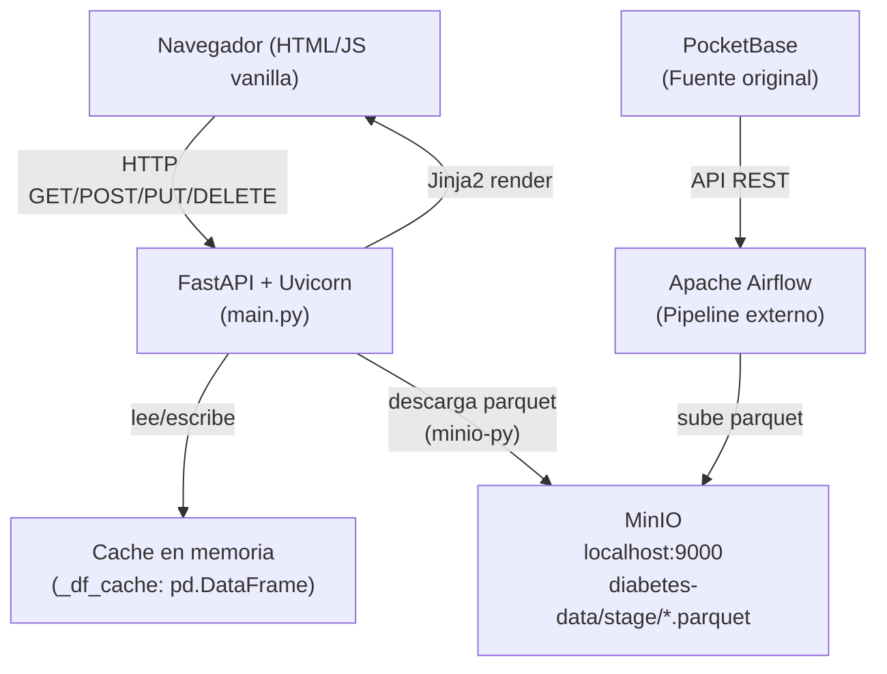
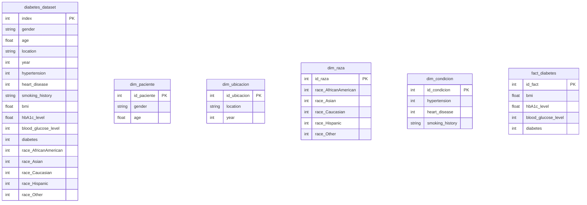

# Documento de Diseño — DiabCare Analytics

## Visión General

DiabCare Analytics es una aplicación web académica de análisis de datos clínicos de diabetes hospitalaria. El sistema lee un archivo `.parquet` almacenado en MinIO, genera tablas de hecho y dimensiones en memoria con pandas, y expone visualizaciones analíticas, consultas de tablas, operaciones CRUD y la información corporativa de la empresa ficticia DiabCare Analytics.

El diseño sigue una arquitectura de dos capas activas:

- **Capa de presentación**: SPA servida como plantilla Jinja2 (`index.html`) con HTML/CSS/JS vanilla.
- **Capa de aplicación + datos**: API REST construida con FastAPI + Uvicorn. No hay base de datos relacional. Los datos viven en un DataFrame de pandas en memoria, cargado desde MinIO al primer acceso.

El sistema es intencionalmente simple: no hay autenticación, no hay ORM, no hay base de datos relacional, y toda la lógica de transformación vive en funciones pandas puras en `main.py`. Esto es coherente con el alcance académico del proyecto.

---

## Arquitectura



### Flujo de solicitud típico

1. El navegador carga `/` → FastAPI renderiza `index.html` con Jinja2.
2. El JS del frontend llama a los endpoints `/api/*` con `fetch()`.
3. FastAPI invoca `get_df()` que retorna la Cache_DF si existe, o descarga el parquet desde MinIO y lo cachea.
4. Las funciones de dimensión/hecho generan DataFrames derivados en memoria a partir de la Cache_DF.
5. La respuesta JSON es consumida por el JS para actualizar el DOM.

### Flujo de recarga del dataset

1. El usuario hace clic en "Recargar Dataset" → `POST /api/cargar-dataset`.
2. FastAPI asigna `_df_cache = None` para invalidar la caché.
3. FastAPI invoca `get_df()` que descarga el parquet más reciente de `diabetes-data/stage/`.
4. FastAPI retorna `{"ok": true, "registros": N, "columnas": [...]}`.

### Pipeline externo (fuera del alcance del Sistema)

El archivo parquet es producido por un pipeline externo independiente:
`PocketBase → Airflow DAG (diabetes_pipeline) → Parquet → MinIO diabetes-data/stage/`

El Sistema solo consume el resultado final (el parquet en MinIO). No orquesta ni controla este pipeline.

---

## Componentes e Interfaces

### Backend — FastAPI (`main.py`)

| Endpoint | Método | Descripción |
|---|---|---|
| `/` | GET | Sirve `index.html` vía Jinja2 |
| `/api/cargar-dataset` | POST | Invalida la caché y fuerza recarga desde MinIO |
| `/api/stats` | GET | Conteos del Dataset y las 5 Tablas_Virtuales + totales con/sin diabetes |
| `/api/tabla/{nombre}` | GET | Filas paginadas de una Tabla_Virtual del TABLAS_MAP |
| `/api/fact/{id_fact}` | GET | Registro individual del Dataset por índice |
| `/api/fact/{id_fact}` | PUT | Actualiza campos clínicos de un registro en la Cache_DF |
| `/api/fact/{id_fact}` | DELETE | Elimina un registro de la Cache_DF y reindexea |
| `/api/chart/diabetes-por-anio` | GET | Conteos con/sin diabetes agrupados por `year` |
| `/api/chart/pacientes-por-ubicacion` | GET | Top-15 ubicaciones por cantidad de registros |
| `/api/chart/distribucion-bmi` | GET | Distribución de registros en 6 rangos de BMI |
| `/api/chart/glucosa-vs-diabetes` | GET | Promedio de glucosa por grupo (con/sin diabetes) |
| `/api/empresa` | GET | Datos corporativos estáticos |

#### Parámetros y validaciones

- `GET /api/tabla/{nombre}`: parámetro de ruta `nombre` (string), query param `limit` (int, default=50, rango 1–500). FastAPI valida el rango automáticamente con `Query(ge=1, le=500)`.
- El TABLAS_MAP es un diccionario Python definido como constante en `main.py`. La validación ocurre antes de cualquier operación sobre el Dataset.
- `PUT /api/fact/{id_fact}`: todos los campos son query params opcionales. Solo se actualizan los campos provistos (no nulos).

#### Gestión de la caché

```python
_df_cache: pd.DataFrame = None

def get_df() -> pd.DataFrame:
    global _df_cache
    if _df_cache is not None:
        return _df_cache
    client = get_minio_client()
    objects = list(client.list_objects(MINIO_BUCKET, prefix=MINIO_PREFIX))
    parquet_files = [o for o in objects if o.object_name.endswith(".parquet")]
    latest = sorted(parquet_files, key=lambda o: o.last_modified, reverse=True)[0]
    response = client.get_object(MINIO_BUCKET, latest.object_name)
    _df_cache = pd.read_parquet(BytesIO(response.read()))
    return _df_cache
```

La caché es un singleton en memoria del proceso FastAPI. Se invalida explícitamente con `POST /api/cargar-dataset`. No hay expiración automática.

#### Conexión MinIO

```python
def get_minio_client():
    return Minio(
        "localhost:9000",
        access_key="admin",
        secret_key="password123",
        secure=False
    )
```

### Tablas Virtuales — Funciones de transformación pandas

Cada Tabla_Virtual se genera en memoria a partir de la Cache_DF mediante una función pura. No hay escritura a disco ni a base de datos.

```python
def get_dim_paciente(df):
    dim = df[["gender", "age"]].drop_duplicates().reset_index(drop=True)
    dim.index.name = "id_paciente"
    return dim.reset_index()

def get_dim_ubicacion(df):
    dim = df[["location", "year"]].drop_duplicates().reset_index(drop=True)
    dim.index.name = "id_ubicacion"
    return dim.reset_index()

def get_dim_raza(df):
    cols = ["race_AfricanAmerican","race_Asian","race_Caucasian","race_Hispanic","race_Other"]
    dim = df[cols].drop_duplicates().reset_index(drop=True)
    dim.index.name = "id_raza"
    return dim.reset_index()

def get_dim_condicion(df):
    cols = ["hypertension", "heart_disease", "smoking_history"]
    dim = df[cols].drop_duplicates().reset_index(drop=True)
    dim.index.name = "id_condicion"
    return dim.reset_index()

def get_fact_diabetes(df):
    fact = df[["bmi", "hbA1c_level", "blood_glucose_level", "diabetes"]].copy()
    fact.index.name = "id_fact"
    return fact.reset_index()
```

**TABLAS_MAP** (whitelist + generadores):
```python
TABLAS_MAP = {
    "diabetes_dataset": lambda df: df,
    "dim_paciente":     get_dim_paciente,
    "dim_ubicacion":    get_dim_ubicacion,
    "dim_raza":         get_dim_raza,
    "dim_condicion":    get_dim_condicion,
    "fact_diabetes":    get_fact_diabetes,
}
```

### Frontend (`index.html`)

SPA de una sola página con navegación por secciones. No hay framework JS; toda la lógica es vanilla JS con `fetch()`.

| Sección | ID DOM | Datos fuente |
|---|---|---|
| Dashboard | `sec-dashboard` | `GET /api/stats` |
| Ver Tablas | `sec-tablas` | `GET /api/tabla/{nombre}` |
| CRUD Fact | `sec-crud` | `GET/PUT/DELETE /api/fact/{id}` |
| Pipeline | `sec-pipeline` | Estático + `POST /api/cargar-dataset` |
| Empresa | `sec-empresa` | `GET /api/empresa` (cacheado en `empresaData`) |
| Objetivos | `sec-objetivos` | `GET /api/empresa` (cacheado en `empresaData`) |

**Caché de empresa**: la variable `empresaData` almacena la respuesta de `/api/empresa` tras la primera carga. Las navegaciones subsiguientes a Empresa y Objetivos reutilizan esta variable sin nueva petición HTTP.

---

## Modelos de Datos

### Esquema del Dataset (parquet fuente)

El archivo `.parquet` contiene ~100,000 registros con las siguientes columnas relevantes:

| Columna | Tipo | Descripción |
|---|---|---|
| `gender` | string | Género del paciente |
| `age` | float | Edad del paciente |
| `location` | string | Ubicación geográfica |
| `year` | int | Año del registro |
| `hypertension` | int (0/1) | Hipertensión preexistente |
| `heart_disease` | int (0/1) | Enfermedad cardíaca preexistente |
| `smoking_history` | string | Historial de tabaquismo |
| `bmi` | float | Índice de masa corporal |
| `hbA1c_level` | float | Nivel de hemoglobina glicosilada |
| `blood_glucose_level` | int | Nivel de glucosa en sangre |
| `diabetes` | int (0/1) | Diagnóstico de diabetes |
| `race_AfricanAmerican` | int (0/1) | Indicador de raza |
| `race_Asian` | int (0/1) | Indicador de raza |
| `race_Caucasian` | int (0/1) | Indicador de raza |
| `race_Hispanic` | int (0/1) | Indicador de raza |
| `race_Other` | int (0/1) | Indicador de raza |

### Tablas Virtuales generadas en memoria



Todas las tablas se derivan del mismo DataFrame fuente (`_df_cache`) mediante `drop_duplicates()` y selección de columnas. No hay claves foráneas explícitas entre ellas en memoria.

### Modelos de respuesta API

**`GET /api/cargar-dataset`** (POST)
```json
{"ok": true, "registros": 100000, "columnas": ["gender", "age", "location", ...]}
```

**`GET /api/stats`**
```json
{
  "diabetes_dataset": 100000,
  "dim_paciente": 4200,
  "dim_ubicacion": 150,
  "dim_raza": 32,
  "dim_condicion": 12,
  "fact_diabetes": 100000,
  "total_con_diabetes": 8500,
  "total_sin_diabetes": 91500
}
```

**`GET /api/tabla/{nombre}?limit=50`**
```json
{
  "total": 100000,
  "rows": [
    {"id_fact": 0, "bmi": 27.3, "hbA1c_level": 5.7, "blood_glucose_level": 140, "diabetes": 0}
  ]
}
```

**`GET /api/fact/{id_fact}`**
```json
{"gender": "Male", "age": 45.0, "bmi": 27.3, "hbA1c_level": 5.7, "blood_glucose_level": 140, "diabetes": 0, ...}
```

**`PUT /api/fact/{id_fact}`**
```json
{"ok": true, "registro": {"gender": "Male", "age": 45.0, "bmi": 28.0, ...}}
```

**`DELETE /api/fact/{id_fact}`**
```json
{"ok": true, "registros_restantes": 99999}
```

**`GET /api/chart/diabetes-por-anio`**
```json
[{"anio": 2019, "con_diabetes": 1200, "sin_diabetes": 8800}]
```

**`GET /api/chart/pacientes-por-ubicacion`**
```json
[{"ubicacion": "California", "total": 9500}]
```

**`GET /api/chart/distribucion-bmi`**
```json
[{"categoria": "25-30", "total": 35000}, {"categoria": "30-35", "total": 28000}]
```

**`GET /api/chart/glucosa-vs-diabetes`**
```json
[{"diabetes": "Con diabetes", "glucosa_promedio": 198.4}, {"diabetes": "Sin diabetes", "glucosa_promedio": 113.2}]
```

**`GET /api/empresa`**
```json
{
  "nombre": "DiabCare Analytics",
  "slogan": "Datos que salvan vidas",
  "mision": "...",
  "vision": "...",
  "objetivos_estrategicos": ["...", "...", "..."],
  "objetivos_tacticos": ["...", "...", "..."],
  "objetivos_operacionales": ["...", "...", "..."]
}
```

---

## Propiedades de Corrección

*Una propiedad es una característica o comportamiento que debe mantenerse verdadero en todas las ejecuciones válidas del sistema.*

### Property 1: TABLAS_MAP rechaza tablas no autorizadas

*Para cualquier* cadena de texto que no pertenezca a las claves del TABLAS_MAP (incluyendo cadenas vacías, nombres arbitrarios e intentos de inyección), el endpoint `GET /api/tabla/{nombre}` SHALL retornar HTTP 400 sin generar ningún DataFrame.

**Valida: Requisito 2.4, 9.1, 9.2**

---

### Property 2: TABLAS_MAP acepta todas las tablas autorizadas

*Para cualquier* nombre de tabla que pertenezca al TABLAS_MAP, el endpoint `GET /api/tabla/{nombre}` SHALL retornar HTTP 200 con los campos `rows` y `total` (asumiendo Dataset disponible en caché).

**Valida: Requisito 2.1, 2.5**

---

### Property 3: Contrato del parámetro limit

*Para cualquier* tabla del TABLAS_MAP y cualquier valor de `limit` en el rango [1, 500], el número de elementos en `rows` SHALL ser menor o igual a `limit`, y el campo `total` SHALL ser mayor o igual al número de elementos en `rows`. Para cualquier valor de `limit` fuera del rango [1, 500] o que no sea un entero, el endpoint SHALL retornar HTTP 422.

**Valida: Requisito 2.1, 2.2, 2.6**

---

### Property 4: get_df es idempotente con caché activa

*Para cualquier* estado de la Cache_DF no nula, invocar `get_df()` dos veces consecutivas SHALL retornar el mismo objeto DataFrame (misma referencia o mismo contenido) sin realizar ninguna descarga adicional desde MinIO.

**Valida: Requisito 1.3, 8.2**

---

### Property 5: Tablas virtuales son deterministas

*Para cualquier* DataFrame de entrada con el mismo contenido, invocar `get_dim_paciente(df)`, `get_dim_ubicacion(df)`, `get_dim_raza(df)`, `get_dim_condicion(df)` y `get_fact_diabetes(df)` dos veces SHALL producir DataFrames con el mismo número de filas y las mismas columnas en ambas invocaciones.

**Valida: Requisito 2.2, 3.2**

---

### Property 6: Stats siempre retorna las 8 claves con valores no negativos

*Para cualquier* estado del Dataset disponible en memoria, el endpoint `GET /api/stats` SHALL retornar un objeto JSON con exactamente 8 claves (`diabetes_dataset`, `dim_paciente`, `dim_ubicacion`, `dim_raza`, `dim_condicion`, `fact_diabetes`, `total_con_diabetes`, `total_sin_diabetes`) donde cada valor es un entero ≥ 0.

**Valida: Requisito 3.1, 3.2**

---

### Property 7: Empresa tiene estructura y cardinalidad fijas

*Para cualquier* invocación de `GET /api/empresa`, la respuesta SHALL contener exactamente los 7 campos especificados, con los tres arrays de objetivos de longitud exactamente 3 cada uno.

**Valida: Requisito 6.1, 6.2**

---

### Property 8: Estructura de respuestas de charts

*Para cualquier* Dataset disponible con datos:
- Cada elemento de `GET /api/chart/diabetes-por-anio` SHALL contener `anio`, `con_diabetes` y `sin_diabetes`.
- Cada elemento de `GET /api/chart/pacientes-por-ubicacion` SHALL contener `ubicacion` y `total`, y la lista SHALL tener como máximo 15 elementos.
- Cada elemento de `GET /api/chart/distribucion-bmi` SHALL contener `categoria` y `total`, con exactamente 6 categorías.
- Cada elemento de `GET /api/chart/glucosa-vs-diabetes` SHALL contener `diabetes` y `glucosa_promedio`, con exactamente 2 elementos.

**Valida: Requisito 4.1, 4.3, 4.5, 4.6**

---

### Property 9: Ordenamiento de charts es consistente

*Para cualquier* Dataset con al menos dos registros distintos:
- `GET /api/chart/diabetes-por-anio` SHALL retornar objetos en orden ascendente por `anio`.
- `GET /api/chart/pacientes-por-ubicacion` SHALL retornar objetos en orden descendente por `total`.

**Valida: Requisito 4.2, 4.4**

---

### Property 10: CRUD respeta los límites del índice

*Para cualquier* valor de `id_fact` menor que 0 o mayor o igual al número de filas de la Cache_DF, los endpoints `GET`, `PUT` y `DELETE /api/fact/{id_fact}` SHALL retornar HTTP 404 con `detail` igual a "Registro no encontrado".

**Valida: Requisito 5.2, 5.7**

---

### Property 11: DELETE reindexea correctamente

*Para cualquier* `id_fact` válido, tras ejecutar `DELETE /api/fact/{id_fact}`, el número de filas de la Cache_DF SHALL ser exactamente `N - 1` donde `N` era el número de filas antes de la eliminación, y los índices del DataFrame resultante SHALL ser contiguos desde 0.

**Valida: Requisito 5.5, 5.6**

---

## Manejo de Errores

### Errores del backend

| Situación | Código HTTP | Campo `detail` |
|---|---|---|
| Tabla no en TABLAS_MAP | 400 | `"Tabla no permitida. Opciones: [...]"` |
| `limit` fuera de rango o no entero | 422 | Mensaje de validación de FastAPI |
| MinIO sin archivos en `stage/` | 404 | `"No hay archivos parquet en MinIO stage/"` |
| MinIO sin archivos `.parquet` | 404 | `"No se encontraron archivos .parquet"` |
| Error de conexión a MinIO | 500 | Descripción de la excepción de minio-py |
| `id_fact` fuera de rango | 404 | `"Registro no encontrado"` |
| Error de BD en endpoints de chart | 500 | Descripción del error |

### Errores del frontend

| Situación | Comportamiento |
|---|---|
| Error de red en `/api/stats` | Tarjeta de error en el grid del Dashboard |
| Error de red al cargar tabla | Mensaje de error en `#table-wrapper` |
| Respuesta no-2xx en CRUD | Alerta roja con `data.detail` durante 5 s |
| Respuesta exitosa en CRUD | Alerta verde con mensaje de confirmación durante 5 s |
| Error de red en recarga de dataset | Alerta roja con mensaje de error |

---

## Estrategia de Pruebas

### Evaluación de aplicabilidad de PBT

Este sistema combina lógica de negocio pura (funciones de transformación pandas, validación de TABLAS_MAP, estructura de respuestas) con operaciones de I/O (MinIO). Las pruebas basadas en propiedades son aplicables a la capa de lógica pura y a los contratos de los endpoints (con mocks de MinIO/DataFrame); las operaciones de I/O se cubren con pruebas de integración.

### Pruebas unitarias (pytest)

- **TABLAS_MAP**: verificar que cada una de las 6 tablas permitidas pasa la validación; verificar que nombres arbitrarios son rechazados con HTTP 400.
- **Validación de `limit`**: valores en borde (1, 500), fuera de rango (0, 501), tipo incorrecto.
- **Funciones de dimensión**: dado un DataFrame de prueba, verificar que `get_dim_paciente`, `get_dim_ubicacion`, etc. retornan DataFrames con las columnas correctas y sin duplicados.
- **Estructura de `/api/empresa`**: verificar que los arrays tienen las longitudes correctas (3, 3, 3).
- **CRUD límites**: mock de Cache_DF con N filas → verificar HTTP 404 para `id_fact = N` y `id_fact = -1`.
- **MinIO no disponible**: mock de `get_minio_client()` lanzando excepción → HTTP 500.
- **MinIO sin parquet**: mock de `list_objects()` retornando lista vacía → HTTP 404.

### Pruebas basadas en propiedades (Hypothesis)

```python
from hypothesis import given, settings, strategies as st
from main import TABLAS_MAP, get_dim_paciente, get_fact_diabetes
import pandas as pd

# Feature: diabcare-analytics, Property 1: TABLAS_MAP rechaza tablas no autorizadas
@given(st.text().filter(lambda s: s not in TABLAS_MAP))
@settings(max_examples=100)
def test_tablas_map_rechaza_no_autorizadas(nombre):
    response = client.get(f"/api/tabla/{nombre}")
    assert response.status_code == 400

# Feature: diabcare-analytics, Property 5: tablas virtuales son deterministas
@given(st.integers(min_value=10, max_value=1000))
@settings(max_examples=50)
def test_dim_paciente_determinista(n_rows):
    df = make_test_df(n_rows)
    result1 = get_dim_paciente(df)
    result2 = get_dim_paciente(df)
    assert len(result1) == len(result2)
    assert list(result1.columns) == list(result2.columns)
```

**Propiedades implementadas como pruebas PBT:**

| Prueba | Propiedad | Estrategia |
|---|---|---|
| TABLAS_MAP rechaza no-autorizadas | Property 1 | `st.text().filter(lambda s: s not in TABLAS_MAP)` |
| TABLAS_MAP acepta autorizadas | Property 2 | `st.sampled_from(list(TABLAS_MAP.keys()))` con DF mockeado |
| Contrato de limit (válido) | Property 3 | `st.integers(min_value=1, max_value=500)` |
| Contrato de limit (inválido) | Property 3 | `st.integers().filter(lambda x: x < 1 or x > 500)` |
| get_df idempotente con caché | Property 4 | Mock de MinIO, invocación doble |
| Tablas virtuales deterministas | Property 5 | `st.integers(min_value=10, max_value=1000)` para tamaño del DF |
| Stats tiene 8 claves ≥ 0 | Property 6 | DF mockeado con distintos tamaños |
| Empresa tiene estructura fija | Property 7 | `settings(max_examples=1)` |
| Estructura de charts | Property 8 | DF mockeado con datos aleatorios |
| Ordenamiento de charts | Property 9 | DF mockeado con al menos 2 ubicaciones/años distintos |
| CRUD límites de índice | Property 10 | `st.integers().filter(lambda x: x < 0 or x >= N)` |
| DELETE reindexea | Property 11 | `st.integers(min_value=0, max_value=N-1)` |

### Pruebas de integración

- Descarga real del parquet desde MinIO local → Dataset con ~100,000 filas.
- Las 5 Tablas_Virtuales se generan sin errores a partir del Dataset real.
- `POST /api/cargar-dataset` invalida la caché y retorna el conteo correcto.
- `GET /api/tabla/fact_diabetes?limit=1` retorna exactamente 1 fila con las columnas correctas.
- `PUT /api/fact/0` con `bmi=99.9` actualiza el valor en la Cache_DF.
- `DELETE /api/fact/0` reduce el conteo en 1 y reindexea correctamente.

### Pruebas de humo (smoke tests)

- El servidor FastAPI arranca sin errores con `uvicorn main:app`.
- La página `/` retorna HTTP 200 con contenido HTML.
- La conexión a MinIO es exitosa desde `get_minio_client()`.
- La descarga del parquet completo finaliza en menos de 30 segundos (Requisito 8.1).
