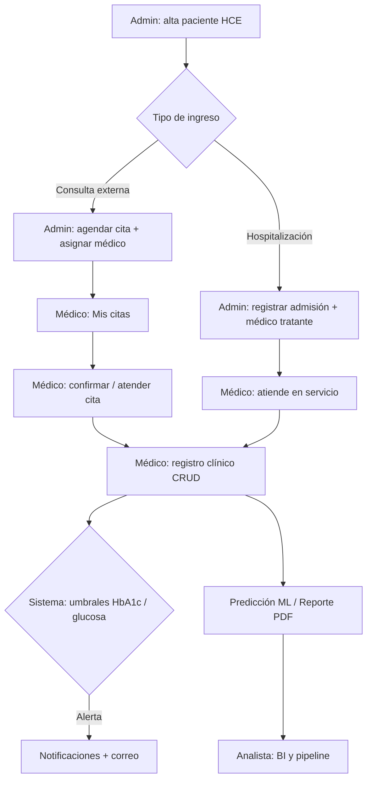

# Flujo clínico end-to-end — DiabCare Analytics

**Actualizado**: 2026-07-05 · **Estado**: Vigente (GA07 demo)

Este documento unifica el recorrido clínico diario, los roles y los módulos del sistema.

---

## 1. Roles y responsabilidades

| Rol | Responsabilidad en clínica | Módulos DiabCare |
|-----|---------------------------|------------------|
| **Administrador** | Recepción, coordinación, usuarios, agenda | Pacientes, Admisiones, **Agenda**, Usuarios, Configuración, Auditoría |
| **Médico** | Atención y documentación clínica | Pacientes (consulta), **Mis citas**, Consultas, Predicción, Reportes, Notificaciones |
| **Analista** | Datos, BI, calidad, ML | Dataset, Pipeline, Modelo ML, Análisis, Estadísticas |

---

## 2. Diagrama del flujo

---

## 3. Pasos detallados

### Paso 1 — Registro del paciente (Administrador)
- **Módulo**: Pacientes / HCE (`/paginas/clinico/pacientes/`)
- **API**: `POST /api/pacientes/`, foto opcional `POST /api/pacientes/{id}/foto`
- **Salida**: expediente con código, documento, sede, foto

### Paso 2a — Cita ambulatoria (Administrador)
- **Módulo**: Agenda (`/paginas/clinico/agenda/`) — **solo administrador**
- **API**: `POST /api/citas/`, catálogo médicos `GET /api/usuarios/medicos`
- **Regla**: el admin elige paciente + **médico asignado** + fecha/hora/motivo
- **Estados**: `programada → confirmada → atendida` (cancelada / no_asistio)

### Paso 2b — Admisión hospitalaria (Administrador)
- **Módulo**: Admisiones (`/paginas/clinico/admisiones/`) — **solo administrador**
- **API**: `POST /api/admisiones/`
- **Regla**: admin elige paciente + **médico tratante** (select de usuarios rol `medico`)

### Paso 3 — Atención (Médico)
- **Módulo**: Mis citas (`/paginas/clinico/mis_citas/`) — **solo médico**
- **API**: `GET /api/citas/mis-citas`, `PUT /api/citas/{id}/estado`
- **Acciones**: confirmar cita; **Atender** marca `atendida` y abre Consultas
- El médico **no agenda** citas ni admisiones

### Paso 4 — Registro clínico (Médico / Admin)
- **Módulo**: Consultas (`/paginas/clinico/registros_clinicos/`)
- **API**: CRUD `/api/registros/`, filtros `/api/registros/buscar`

### Paso 5 — Alertas (Sistema)
- **Módulo**: Notificaciones (P10)
- Umbrales: HbA1c > 7.5, glucosa > 180
- Correo vía Brevo/SMTP (configuración P12)

### Paso 6 — Análisis y salidas (Médico / Analista)
- Predicción ML (P6), Reportes PDF (P7), Dashboard (P5)
- Analista: Dataset (P4), Pipeline (P8), Modelo ML (P14)

---

## 4. Matriz de permisos (clínico)

| Módulo | administrador | medico | analista |
|--------|:---:|:---:|:---:|
| pacientes | ✅ | ✅ | |
| admisiones | ✅ | | |
| citas (agenda) | ✅ | | |
| mis_citas (API `/api/citas/mis-citas`) | | ✅ | |
| registros | ✅ | ✅ | |
| analisis | ✅ | ✅ | ✅ |
| prediccion | ✅ | ✅ | ✅ |
| reportes | ✅ | ✅ | |
| notificaciones | ✅ | ✅ | ✅ |

Fuente autoritativa: `backend/nucleo/utilidades/Dependencias.py` (`PERMISOS_MODULOS`).

---

## 5. Demo rápida (15 min)

1. Login **admin** → Pacientes → crear paciente con foto  
2. Agenda → agendar cita → elegir médico del listado  
3. Logout → login **médico** → Mis citas → Confirmar → Atender  
4. Consultas → nuevo registro  
5. Notificaciones → revisar alertas  
6. (Opcional) Reporte PDF / Predicción  

---

## 6. Especificaciones por paquete

| Paquete | Spec |
|---------|------|
| Pacientes / HCE | `paquetes/P-pacientes-spec.md` |
| Admisiones | `paquetes/P-admisiones-spec.md` |
| Agenda / Citas | `paquetes/P-citas-spec.md` |
| Registros | `paquetes/P03-registros-clinicos-spec.md` |
| Notificaciones | `paquetes/P10-notificaciones-spec.md` |
