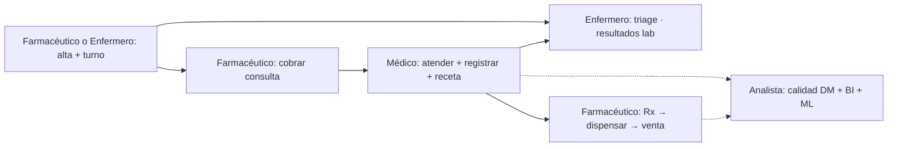

# Flujos por rol — DiabCare Analytics

**Actualizado**: 2026-07-16 · **Excluye**: `administrador` (app / supervisión técnica)

Fuente: `Dependencias.py` (`PERMISOS_MODULOS` + `PERMISOS_ESCRITURA`) y menú `navegacion.js` (`ACCESO`).

---

## 0. Quién es quién

| Rol | Papel diario | Límite duro |
|-----|--------------|-------------|
| **Farmacéutico** | Admin. clínica: recepción, ingresos, **caja (cobro consulta)**, farmacia, facturación | No emite recetas ni atiende consulta |
| **Enfermero** | Atención de enfermería: pacientes, ingresos/turnos, **triage**, **lab (resultados)** | Sin farmacia, sin caja, sin emitir recetas |
| **Médico** | Atiende **solo si la consulta ya está cobrada**, documenta, ordena lab, emite recetas | Sin turnos, admisión, inventario ni cobro |
| **Analista** | Calidad diabetes (HbA1c/riesgo), BI, dataset, pipeline, ML, reportes; consulta facturación/RRHH | Sin atender pacientes ni escribir en caja/RRHH |

---

## 1. Farmacéutico (recepción + caja)

```text
Pacientes → separar turno (Agenda)
→ Cobrar consulta (caja / Facturación · tarifa CONS-DM)
→ Paciente pasa al médico
→ (después) Farmacia 1→10 si hay Rx · cierre
→ Facturación de farmacia / otros servicios
```

**RN-CIT-010:** no se marca la cita como atendida sin factura de consulta **pagada** (`encounter_id` = `id_cita`).

---

## 2. Enfermero (rol clínico)

```text
Pacientes / HCE  (alta o preparación del paciente)
    ↓
Recepción / turnos  ──o──  Admisiones hospitalarias
    ↓
(paciente va a caja del farmacéutico a pagar la consulta)
    ↓
Urgencias → Triage (prioridad / motivo)
    ↓
Laboratorio → cargar resultados de órdenes del médico
    ↓
Notificaciones (alertas clínicas)
```

**Home:** Pacientes.  
**No tiene:** Farmacia, Recetas, Facturación, Dataset/ML.  
**Turnos:** puede separar; el cobro de consulta lo hace el farmacéutico en caja.

---

## 3. Médico

```text
Consulta médica → solo turnos con consulta cobrada (confirmada)
→ atender → registro / comorbilidades
→ Lab: ordenar · Urgencias: Atender
→ Recetas emitidas → las ve el farmacéutico en Rx pendientes
```

---

## 4. Analista (calidad clínica de diabetes)

**Home:** Calidad diabetes.

```text
Calidad diabetes (control HbA1c · riesgo · sedes)
    ↓
Dataset / generador  →  Pipeline ELT  →  Modelo ML (entrenar / métricas)
    ↓
Predicción (validar escenarios)  ·  Estadísticas  ·  Reportes PDF
    ↓
Facturación / RRHH solo lectura (contexto hospitalario)
```

**Aporta en diabetes:**
- % control (HbA1c &lt; 7%), subóptimo (7–9%) y descontrol (≥ 9%)
- Estrato de riesgo alto/medio/controlado en la cohorte DM
- Comorbilidades (HTA, cardiopatía) y obesidad en diabéticos
- Sedes y grupos de edad con más descontrol → input a reportes y al modelo

**No hace:** altas de pacientes, agenda, atención, recetas, cobros.

---

## 5. Cadena conjunta



---

## 6. Matriz (entrada al módulo)

| Módulo | farmaceutico | enfermero | medico | analista |
|--------|:---:|:---:|:---:|:---:|
| pacientes | ✅ | ✅ | ✅ | |
| admisiones / citas | ✅ | ✅ | | |
| mis_citas / registros | | | ✅ | |
| laboratorio | | ✅ resultados | ✅ ordenar | |
| urgencias | ✅ triage | ✅ triage | ✅ atender | |
| recetas | | | ✅ | |
| farmacia | ✅ | | | |
| facturacion | ✅ escribir | | | ✅ leer |
| rrhh | | | | ✅ leer |
| dataset / pipeline / ML | | | | ✅ |
| calidad diabetes / análisis / predicción / reportes | | ✅ | ✅ | ✅ |

---

## 7. Qué no confundir

1. **Enfermero ≠ farmacéutico.** Enfermería es clínica; el mostrador/caja es del farmacéutico.
2. **Cobro de consulta ≠ cobro de farmacia.** La consulta se cobra **antes** de atender; la farmacia es después de la receta.
3. Catálogo ≠ lo recetado → Farmacia **Rx pendientes**.
4. Recetas: solo médico; despacho: solo farmacéutico.
5. Lab: médico ordena; enfermero carga resultado.
